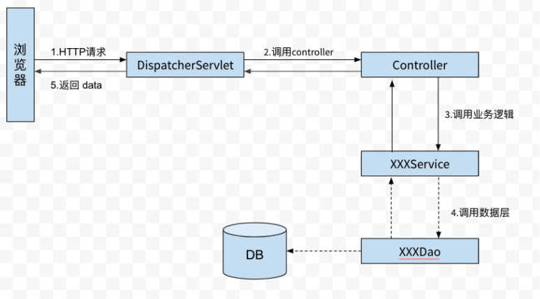

# MiniTwitch
- Start date: 02042022
- Author: Yuanfeng Li

## Final Product Showcase:
1. YouTube link full video: https://youtu.be/WpMmNps2_uQ
2. YouTube link for Registration and Login: https://youtu.be/PqwwdydQoxo

**Tech Stacks**:
- Frontend:
*HTML, JavaScript, React, Ant Design, REST API*
- Backend:
*Java, Spring MVC, Tomcat, MySQL*
- Deployment on AWS:
*EC2 (instance hold Tomcat server), RDS (MySQL database implement data tier)*

**Project process (using Spring MVC)**:

## Steps in history: 
1. set up - 02042022
2. prototype deployed on AWS, showcases recorded - 02052022